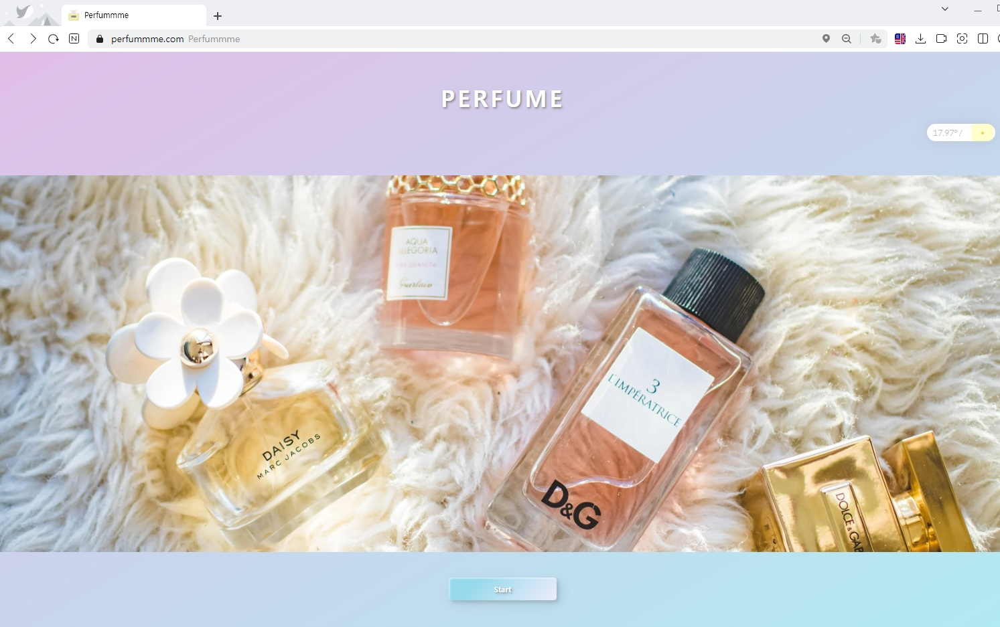
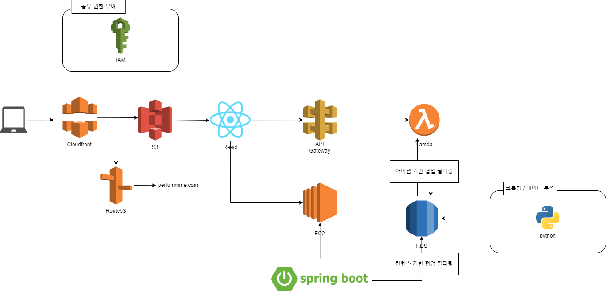

# Frontend
프론트공간

perfummme.com

<h1 style = "text-align: center">
한국항공대 산학프로젝트 I : 향수 추천 웹 서비스 PERFUME
</h1>

## 🌟 PERFUME : 아이템 기반 협업 필터링을 사용한 향수 추천시스템

## 👇🏻 서비스 링크

[바로가기](https://perfummme.com/)

## 📷 스크린샷

## ⚙️ 아키텍처

## 📌 팀원 정보

👩‍🦰 이학준 [@Jinger](https://github.com/kaulhj)

😆 신진우 [@jinwooshin](https://github.com/goldadam)

👨 류호원 [@howon-ryu](https://github.com/howon-ryu)

🤵 홍준표 [@hjp1016](https://github.com/hjp1016)

🧔 박수용 [@Su Yong Park](https://github.com/parkkingcar)

## 🛠 사용 기술

- ### **프론트엔드**

- ### **형상 관리**

- ### **백엔드**

- ### **기타**
